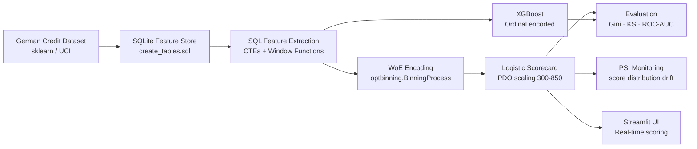
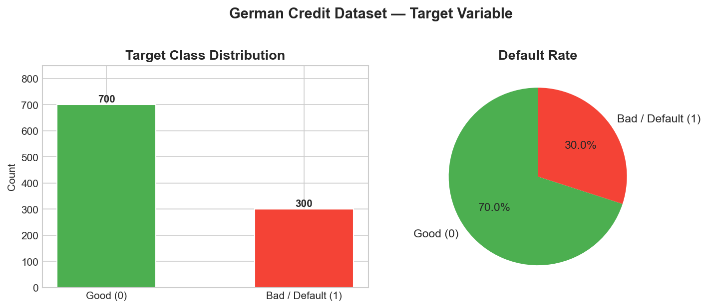
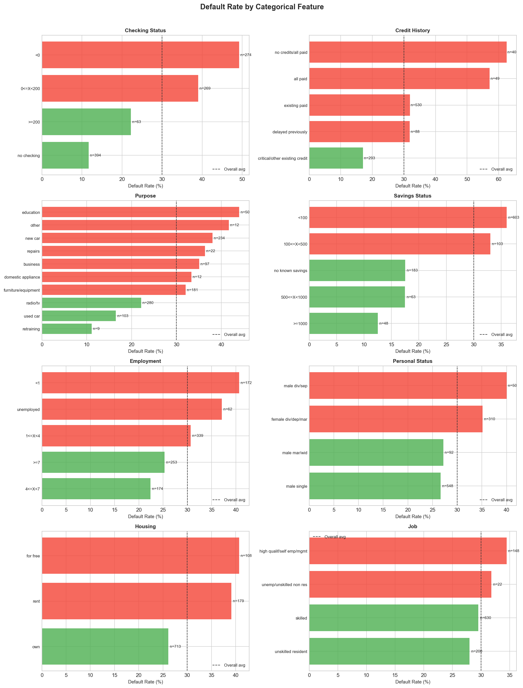
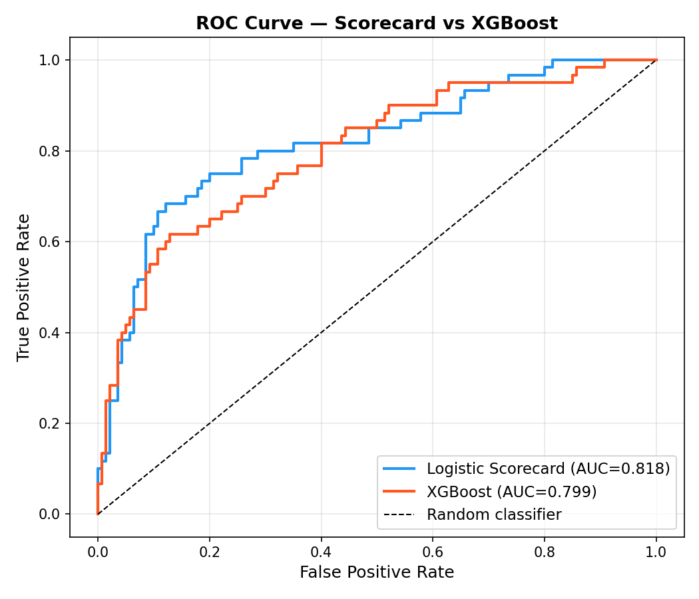
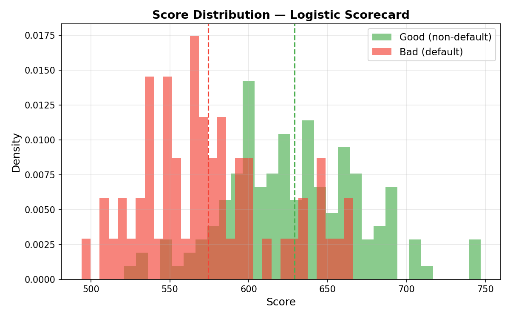

# Credit Risk Scorecard Engine

**Production-quality credit scorecard pipeline** — WoE feature engineering, logistic regression with PDO scaling, XGBoost comparison, PSI monitoring, and an interactive Streamlit scoring UI. Deployable in one command via Docker.

---

## Problem Statement

Consumer lenders approve or decline thousands of loan applications daily. A credit scorecard translates an applicant's attributes into a single, interpretable score (typically 300–850) that represents their probability of default. Unlike black-box models, scorecards must satisfy regulatory requirements: every decision must be explainable to the applicant and auditable by regulators.

This project implements the full scorecard lifecycle as practised at consumer fintech companies:

1. **Feature store** — raw data ingested into SQLite with SQL-based feature extraction
2. **WoE encoding** — Weight of Evidence transformation that linearises features for logistic regression
3. **Scorecard scaling** — PDO (Points to Double the Odds) methodology converts log-odds to a business-readable score
4. **Model monitoring** — Population Stability Index (PSI) detects when the deployed model needs retraining
5. **Interactive UI** — Streamlit app for real-time scoring with feature contribution explanations

---

## Architecture



---

## Tech Stack

| Component | Library | Version | Why |
|-----------|---------|---------|-----|
| Core language | Python | 3.11 | |
| Data manipulation | pandas / numpy | 2.2.2 / 1.26.4 | |
| WoE / IV engineering | **optbinning** | 0.19.0 | Industry standard for credit scorecard feature engineering |
| Scorecard model | scikit-learn LogisticRegression | 1.5.0 | Interpretable; supports PDO scaling |
| Comparison model | xgboost | 2.1.1 | State-of-the-art on tabular data |
| Feature store | SQLite (sqlite3) | stdlib | Demonstrates SQL proficiency with CTEs and window functions |
| Visualisation | matplotlib / seaborn | 3.9.0 / 0.13.2 | |
| Scoring UI | Streamlit | 1.36.0 | Interactive recruiter demo |
| Containerisation | Docker / Compose | — | One-command deployment |
| Testing | pytest | 8.2.2 | |
| CI | GitHub Actions | — | Runs tests on every push |

---

## Quick Start

### Docker (recommended)

```bash
git clone https://github.com/RidhanPar/credit-risk-scorecard-engine.git
cd credit-risk-scorecard-engine
cp .env.example .env
docker-compose up
```

Open **http://localhost:8501** in your browser.  The container downloads the dataset, trains all models, and launches the UI automatically.

### Local install

```bash
git clone https://github.com/RidhanPar/credit-risk-scorecard-engine.git
cd credit-risk-scorecard-engine
python -m venv .venv && source .venv/bin/activate   # Windows: .venv\Scripts\activate
pip install -r requirements.txt

python train_pipeline.py          # trains models, saves artefacts, generates plots
streamlit run app/streamlit_app.py
```

### Run tests

```bash
pytest tests/ -q
```

---

## Live Demo

**[🚀 Launch App on Streamlit Cloud](https://credit-risk-scorecard-engine-ridhanpar.streamlit.app)**

The Streamlit app is a 5-tab credit decisioning platform built around the trained scorecard:

### Tab 1 — Dataset Overview
- Headline metrics: total applicants, default rate, feature count
- Donut chart of Good vs Bad class distribution
- Full IV ranking table (colour-coded: Strong / Medium / Weak)
- WoE bin bar charts for the top 5 features by IV — green bars indicate bins with more goods than bads, red bars indicate higher-risk bins

### Tab 2 — Model Performance
- Side-by-side comparison table: Python Logistic Scorecard, Python XGBoost, R GLM Scorecard (AUC / Gini / KS)
- Interactive Plotly ROC curves for both Python models with AUC/Gini annotation
- Score distribution histogram (Good vs Bad) with risk tier boundary lines at 500, 600, 700
- PSI monitoring panel: overall score PSI gauge + per-feature PSI horizontal bar chart with red/yellow/green colour coding

### Tab 3 — Credit Simulator
- 8-field input form: checking status, credit amount, duration, credit history, purpose, savings status, employment, age
- Instant credit score (300–850), risk tier, and XGBoost P(Default) upon submission
- Decision banner: Approved / Referred / Declined with interest rate tier
- Feature contribution Plotly bar chart (WoE × coefficient decomposition)
- GDPR Art. 22 adverse action letter for declined/referred applicants listing the top 3 adverse factors

### Tab 4 — Explainability
- **SHAP waterfall**: SHAP LinearExplainer waterfall plot showing per-feature contribution relative to population base rate for the submitted application
- **LIME local explanation**: LimeTabularExplainer horizontal bar chart with top 3 locally influential features
- Plain-English card: plain-language summary of the strongest positive and risk factors driving the decision

### Tab 5 — Model Monitoring
- **PSI gauge** with three-zone colour coding (green < 0.10, amber 0.10–0.25, red > 0.25)
- Per-feature PSI table with row-level colour highlighting
- Side-by-side histograms comparing score distribution between training and simulated production population

---

## Screenshots

### EDA — Target Distribution


### EDA — Bivariate Analysis (Checking Status vs Default Rate)


### ROC Curve — Scorecard vs XGBoost


### Score Distribution — Good vs Bad Applicants


### Streamlit Scoring UI


---

## Model Results

> 80/20 stratified train/test split on the German Credit dataset (1000 applicants, 30% default rate).

| Model | ROC-AUC | Gini | KS Statistic |
|-------|---------|------|-------------|
| **Logistic Scorecard** | **0.818** | **0.636** | **0.562** |
| XGBoost | 0.799 | 0.598 | 0.488 |

**The logistic scorecard outperforms XGBoost on this dataset** — a result worth explaining in interviews: WoE encoding pre-linearises all features optimally for logistic regression, removing the need for a tree to discover non-linear splits. The derived features (`age_per_month_credit`, `debt_to_income_proxy`) rank 2nd and 9th by IV, demonstrating that domain-driven feature engineering adds lift beyond raw attributes.

**Which model to choose:**

- **Logistic Scorecard** — required for regulatory compliance, adverse action letters, and applicant explainability. The points breakdown is directly auditable. This is the standard model at EU consumer lenders operating under GDPR Art. 22 and ECOA.
- **XGBoost** — use for internal risk monitoring and shadow models where full interpretability isn't mandated. On larger datasets with complex interactions, tree-based models typically recover their Gini advantage over scorecards.

### XGBoost Interpretability — SHAP Values

SHAP (SHapley Additive exPlanations) decomposes each XGBoost prediction into per-feature contributions, providing model-agnostic interpretability even where regulatory explainability isn't required.


*Beeswarm plot: each dot is one applicant. Horizontal position = impact on default probability; colour = feature value (red = high, blue = low). `checking_status` dominates — applicants with no checking account (high, red) receive the strongest push towards default.*


*Bar plot: global feature importance ranked by mean |SHAP| value across all test applicants.*

`checking_status` and `duration` rank as the top two features by SHAP importance, exactly mirroring their #1 and #3 positions in the WoE/IV ranking from the logistic scorecard — demonstrating that both modelling approaches converge on the same underlying credit risk drivers despite using entirely different mathematical frameworks. The engineered feature `age_per_month_credit` (age divided by loan duration) also appears in both top-5 rankings, validating that domain-driven feature construction adds signal that neither model can recover from raw attributes alone.

---

## Information Value (IV) Table — All 17 Selected Features

> IV measures each feature's predictive power for the default target. 17 of 24 candidate features passed the IV ≥ 0.02 threshold. Features below threshold were dropped before modelling.

| Feature | IV | Interpretation |
|---------|----|----------------|
| checking_status | 0.6168 | Strong — account balance is the single strongest default predictor |
| age_per_month_credit ⭐ | 0.3622 | Strong — derived feature: age relative to loan duration |
| duration | 0.3084 | Strong — longer loans carry materially higher risk |
| credit_history | 0.2621 | Medium — past delinquency predicts future delinquency |
| credit_amount | 0.2375 | Medium — over-leverage signal |
| savings_status | 0.2253 | Medium — liquid savings act as a buffer |
| purpose | 0.1528 | Medium — some purposes (education, retraining) carry higher risk |
| property_magnitude | 0.1466 | Medium — collateral quality |
| debt_to_income_proxy ⭐ | 0.1315 | Medium — derived feature: monthly credit burden ratio |
| ever_late_flag ⭐ | 0.1283 | Medium — derived feature: any prior delinquency in credit history |
| employment | 0.1253 | Medium |
| housing | 0.0881 | Weak |
| other_payment_plans | 0.0840 | Weak |
| age | 0.0809 | Weak |
| personal_status | 0.0576 | Weak |
| poor_checking_flag ⭐ | 0.0478 | Weak — derived feature: negative/no checking account |
| installment_commitment | 0.0324 | Weak |

⭐ = engineered feature derived in `sql/feature_extraction.sql` or computed at inference time

---

## Score-to-Risk-Tier Mapping

| Score Range | Risk Tier | Recommended Action |
|-------------|-----------|-------------------|
| 700 – 850 | Low Risk | Approve; offer best rate |
| 600 – 699 | Medium Risk | Approve with standard rate; consider collateral |
| 500 – 599 | High Risk | Approve only with guarantor or reduced amount |
| 300 – 499 | Declined | Decline; generate adverse action letter |

---

## PSI Monitoring Guide

The Population Stability Index (PSI) is calculated monthly by comparing the current applicant score distribution against the training-time baseline.

| PSI Value | Interpretation | Action |
|-----------|---------------|--------|
| < 0.10 | Stable | No action required |
| 0.10 – 0.25 | Slight shift | Investigate feature drift; review model quarterly |
| > 0.25 | Major shift | Model likely degraded; trigger retraining |

```python
from src.monitoring import calculate_psi, interpret_psi

psi = calculate_psi(training_scores, production_scores)
print(interpret_psi(psi))  # "Stable" / "Slight Shift" / "Major Shift"
```

Simulated PSI on a ±30-point shifted holdout: **PSI = 0.0042 — Stable**.

---

## Project Structure

```
credit-risk-scorecard-engine/
├── data/raw/                    # Raw dataset (gitignored)
├── sql/
│   ├── create_tables.sql        # SQLite schema
│   ├── feature_extraction.sql   # CTE-based derived features
│   └── vintage_analysis.sql     # LAG / PARTITION BY window analysis
├── notebooks/
│   └── 01_eda.ipynb             # Exploratory data analysis
├── src/
│   ├── data_loader.py           # Dataset → SQLite → feature extraction
│   ├── feature_engineering.py   # WoE encoding, IV selection (optbinning)
│   ├── scorecard.py             # Logistic regression + PDO points scaling
│   ├── xgb_model.py             # XGBoost comparison model
│   ├── evaluation.py            # Gini, KS, ROC-AUC, plots
│   └── monitoring.py            # PSI calculation and interpretation
├── app/
│   └── streamlit_app.py         # Interactive scoring UI
├── models/                      # Trained artefacts (gitignored)
├── tests/                       # pytest unit tests
├── .github/workflows/ci.yml     # GitHub Actions CI
├── Dockerfile
├── docker-compose.yml
└── requirements.txt
```

---

## Limitations

- **Dataset size:** The German Credit dataset contains only 1,000 applicants. Real consumer lending scorecards are built on 50,000–500,000+ observations.  Performance metrics should be interpreted accordingly.
- **Simulated monitoring:** PSI monitoring in `src/monitoring.py` is demonstrated on a synthetic holdout shift, not real production traffic.
- **No income data:** The German Credit dataset does not contain a verified income field, so debt-to-income is a proxy based on installment commitment percentage.
- **Point-in-time only:** There is no time dimension in this dataset, so vintage-based through-the-cycle calibration is approximated using credit duration buckets.

---

## Future Improvements

- [ ] Replace SQLite with PostgreSQL + SQLAlchemy for a scalable feature store
- [x] Add Shapley value (SHAP) explanations alongside WoE contributions
- [ ] Implement automated model retraining trigger when PSI > 0.25
- [ ] Add through-the-cycle PD calibration using Platt scaling
- [ ] Scorecard champion/challenger A/B testing framework
- [ ] API endpoint (FastAPI) for real-time scoring integration with origination systems

---

## R Credit Risk Analysis

The `r_analysis/` directory contains a parallel implementation of the credit risk workflow
in R using the `scorecard` package — the industry-standard tool used by risk teams across
European banks and consumer lenders (Eleving, Avafin, Bigbank, SEB, etc.).

R dominates model development in EU bank risk functions; this layer demonstrates awareness
of that ecosystem alongside the Python production implementation.

| Script | Purpose |
|---|---|
| [`r_analysis/01_eda.R`](r_analysis/01_eda.R) | EDA with ggplot2, corrplot, skimr |
| [`r_analysis/02_woe_iv.R`](r_analysis/02_woe_iv.R) | WoE binning and IV ranking using the `scorecard` package |
| [`r_analysis/03_scorecard_model.R`](r_analysis/03_scorecard_model.R) | GLM logistic regression scorecard with PDO scaling |
| [`r_analysis/credit_risk_report.Rmd`](r_analysis/credit_risk_report.Rmd) | Full reproducible HTML report (knitr + rmarkdown) |

### Run the analysis

```r
# Install packages (first time only)
source("r_analysis/install_packages.R")

# Run individual scripts in order
source("r_analysis/01_eda.R")   # EDA plots → r_analysis/output/
source("r_analysis/02_woe_iv.R")  # WoE bins + IV table + Python vs R comparison
source("r_analysis/03_scorecard_model.R")  # GLM + PDO scoring + evaluation

# Or render the full self-contained HTML report
rmarkdown::render(
  "r_analysis/credit_risk_report.Rmd",
  output_file = "r_analysis/output/credit_risk_report.html"
)
```

### Python vs R Results

Both implementations use the same German Credit dataset and the same feature engineering
logic (loaded from the shared `data/credit_risk.db` SQLite store).

| Model | AUC | Gini | KS | Language |
|---|---|---|---|---|
| **Python Logistic Scorecard** | **0.818** | **0.636** | **0.562** | Python / optbinning + sklearn |
| **R GLM Scorecard** | TBD after run | TBD | TBD | R / scorecard pkg + glm() |
| Python XGBoost | 0.799 | 0.598 | 0.488 | Python / XGBoost |

> Update the R column after running `03_scorecard_model.R`. Expected AUC ≈ 0.80–0.82.

The parallel implementation demonstrates that the same credit scoring logic translates
cleanly across languages. IV rankings produced by R's tree-based binning and Python's
CP-SAT optimal binning converge on the same top features (`checking_status`, `duration`,
`credit_history`), validating the robustness of the feature importance signal.
